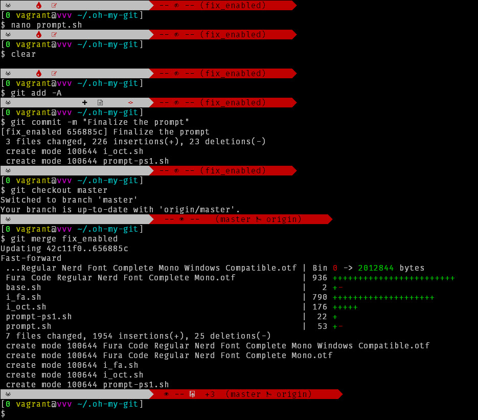

# Awesome Git Prompt



This project aims to provide an awesome git aware bash prompt for Varying Vagrant under Windows.

But it will definitely work for any host OS.

> Lovingly Forked from [oh-my-git](https://github.com/arialdomartini/oh-my-git)

## Installing Fonts

* Install the provided fonts. If you are on Windows, then install the `Windows Compatible` one.
* Under Windows open Git Bash. Right click on the title bar and go to `Options > Text`.
* Select the `FuraCode NF` font with 12pt size.
* Apply and save changes.

## Installing the prompt

Under your vagrant, first ssh into the box.

```bash
vagrant ssh
```

Now once under vagrant, run this command.

```bash
git clone https://wpquark.io/vagrant/bash-prompt-awesome.git ~/.oh-my-git && echo source ~/.oh-my-git/prompt.sh >> ~/.bashrc
```

Now restart the prompt. Under windows

```bash
exit
vagrant ssh
```

Enjoy.
